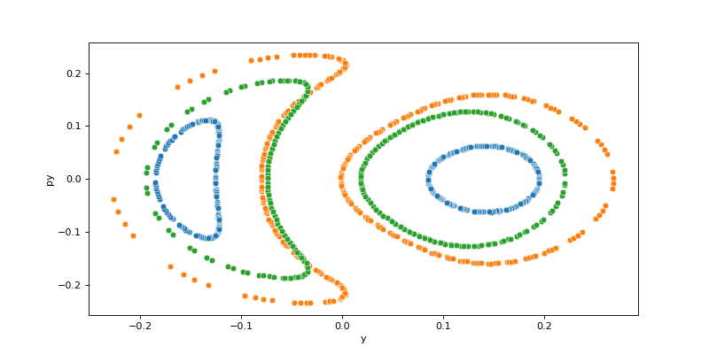
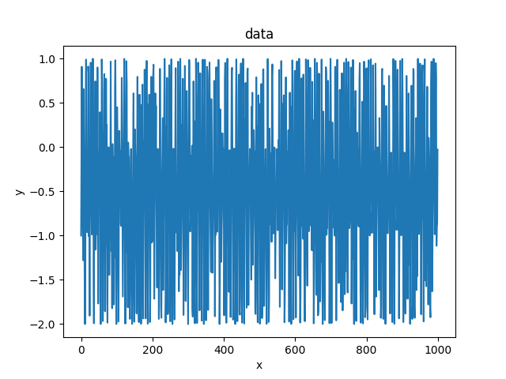
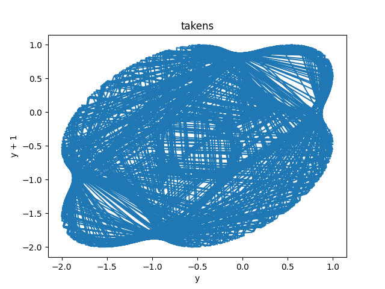
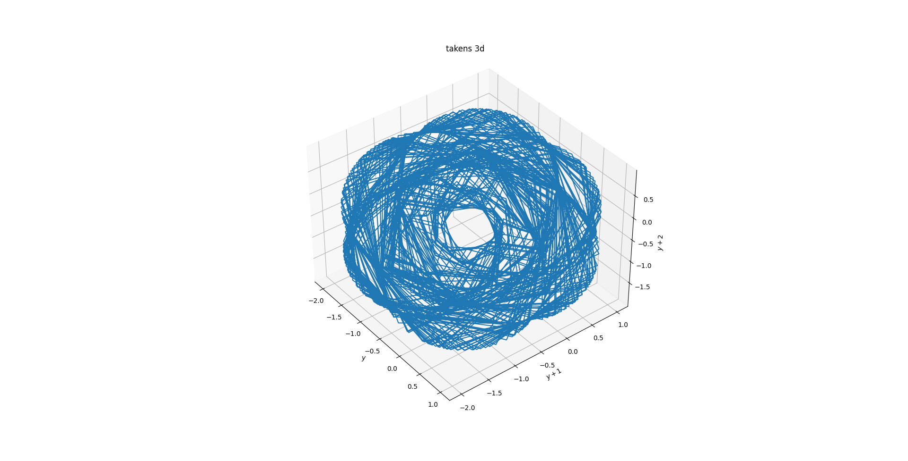
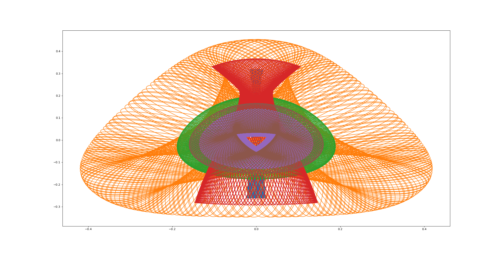
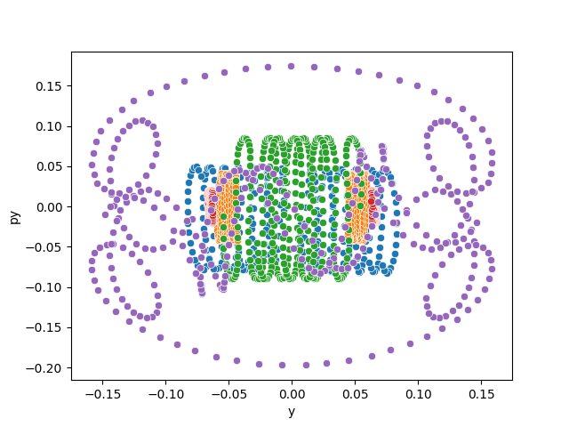
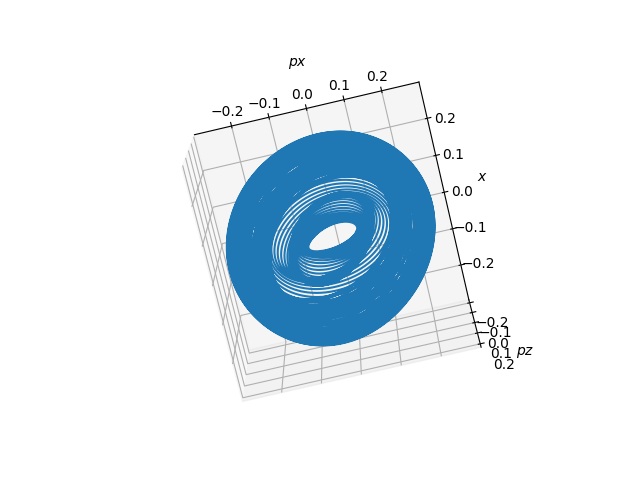

# Henon-Heiles

This repository presents the solution of the Henon-Heiles system for 2d and 3d arrays.

# Data

Initially, a 1d array is generated in the code with the addition of a random element. To transform a 1d array into a 2d array, I used the Takens theorem, which allows you to translate an array into a pseudo-phase space [1].

Initial data:

After the transformation by the Takens theorem:

You can also use this to convert to a 3d array:

# 2d Henon-Heiles

The integral in the Henon-Heiles system for 2d looks like this:

&space;&space;=&space;&space;&space;\frac{1}{2}&space;&space;\big(&space;p^{2}_{x}&space;&plus;&space;p^{2}_{y}&space;&plus;&space;A&space;x^{2}&space;&plus;&space;B&space;x^{2}&space;\big)&space;&plus;&space;D&space;x^{2}y&space;&space;&plus;&space;&space;\frac{C}{3}&space;&space;y^{3}&space;)

The following coefficient values are used in this code:
* A = B = D = 1
* C = -1

In order for the system to be integrable, the following condition must be met:

H <= 1/6

The "plots_2d_hh" folder contains examples of constructing calculations for x vs. y and y vs. py

# 3d Henon-Heiles

The integral in the Henon-Heiles system for 3d looks like this:

&space;&space;=&space;&space;&space;\frac{1}{2}&space;&space;\big(&space;p^{2}_{x}&space;&plus;&space;p^{2}_{y}&space;&plus;&space;p^{2}_{z}&space;&plus;&space;A&space;x^{2}&space;&plus;&space;B&space;z^{2}&space;&space;C&space;y^{2}\big)&space;&plus;&space;&space;\big(&space;&space;\alpha&space;x^{2}&space;&plus;&space;&space;\gamma&space;&space;z^{2}&space;&space;\big)z&space;&plus;&space;&space;\frac{&space;\beta&space;}{3}&space;)

In the code, all coefficients are equal to 1

The "plots_3d_hh" folder contains examples of constructing calculations for plots and phase space

# Future modification

I plan to add a calculation of the escape dynamics (Wadas lakes), their fractal dimension.